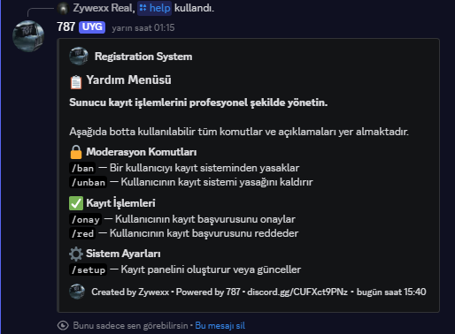

# 📝 Registration System Bot

> Yukarıdaki görsel botun `/help` komutu ile oluşturduğu yardım menüsünü göstermektedir.

Bu proje, Discord sunucularında **kayıt (registration) süreçlerini profesyonel ve düzenli bir şekilde yönetmek** amacıyla geliştirilmiş bir Discord botudur. Sunucu yetkililerinin kullanıcı kayıtlarını kolayca onaylamasını, reddetmesini ve gerekirse kayıt sisteminden yasaklamasını sağlar.

Bot, modern **slash komutlar** kullanır ve kullanıcı dostu bir **yardım menüsü (help paneli)** içerir.

---

## 🚀 Temel Amaç

* Sunucuya giren kullanıcıların **kontrollü şekilde kayıt edilmesini** sağlamak
* Yetkililer için **hızlı, sade ve güvenli** bir kayıt yönetim sistemi sunmak
* Karmaşık işlemleri tek komutla yönetilebilir hale getirmek

---

## 📌 Özellikler

### 🔐 Moderasyon Komutları

* Kayıt sistemini kötüye kullanan veya kurallara uymayan kullanıcıları engelleme
* Daha önce yasaklanan kullanıcıların yasağını kaldırma

### ✅ Kayıt İşlemleri

* Kullanıcı kayıt başvurularını **onaylama**
* Kullanıcı kayıt başvurularını **reddetme**

### ⚙️ Sistem Ayarları

* Kayıt panelini oluşturma veya güncelleme
* Sunucuya özel yapılandırma desteği

### 📘 Yardım Menüsü

* Tüm komutlar tek bir yardım panelinde listelenir
* Komut açıklamaları sade ve anlaşılır şekilde sunulur

---

## 🧭 Komutlar (Özet)

| Komut    | Açıklama                                |
| -------- | --------------------------------------- |
| `/ban`   | Kullanıcıyı kayıt sisteminden yasaklar  |
| `/unban` | Kullanıcının kayıt yasağını kaldırır    |
| `/onay`  | Kullanıcının kayıt başvurusunu onaylar  |
| `/red`   | Kullanıcının kayıt başvurusunu reddeder |
| `/setup` | Kayıt panelini oluşturur veya günceller |

---

## 🛠️ Kullanım Senaryosu

1. Bot sunucuya eklenir
2. Yetkili `/setup` komutu ile kayıt panelini kurar
3. Kullanıcılar kayıt başvurusu yapar
4. Yetkililer başvuruları `/onay` veya `/red` ile yönetir
5. Gerekirse kullanıcılar `/ban` komutu ile sistemden engellenir

---

## 🔒 Güvenlik ve Yetkilendirme

* Komutlar sadece **yetkili roller** tarafından kullanılabilir
* Kayıt işlemleri kontrol altındadır
* Sunucu düzenini bozabilecek işlemler sınırlandırılmıştır

---

## 🧑‍💻 Geliştirici Bilgisi

* **Created by:** Zywexx
* **Powered by:** 787
* **Discord:** https://discord.gg/CUFXct9PNz

---

## 📎 Notlar

* Bot, orta ve büyük ölçekli Discord sunucuları için uygundur
* Geliştirilmeye ve yeni özellikler eklenmeye açıktır
* Özelleştirilmiş sistemler (rol bazlı kayıt, otomatik log, puanlama vb.) eklenebilir

---

> Bu bot, sunucu düzenini korumak ve kayıt süreçlerini kolaylaştırmak için tasarlanmıştır.
